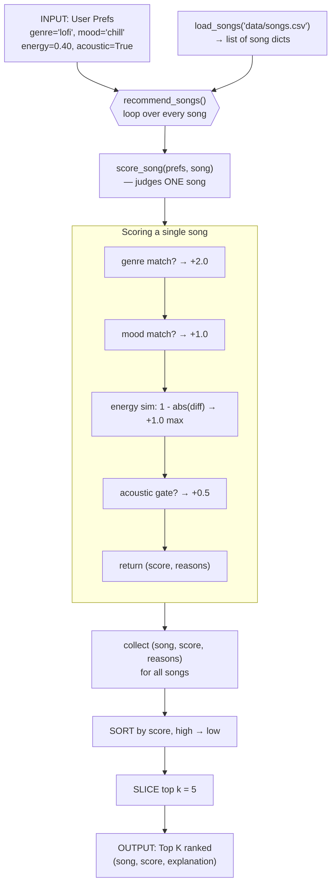

# 🎵 Music Recommender Simulation

## Project Summary

In this project you will build and explain a small music recommender system.

Your goal is to:

- Represent songs and a user "taste profile" as data
- Design a scoring rule that turns that data into recommendations
- Evaluate what your system gets right and wrong
- Reflect on how this mirrors real world AI recommenders

Replace this paragraph with your own summary of what your version does.

---

## How The System Works

### How the system decides what to recommend

The recommender works in two steps. First, the **Scoring Rule** (`score_song`) grades one song at a time, adding up points for how well it matches the user's genre, mood, energy, and acoustic taste (a perfect song scores about 4.5). Then the **Ranking Rule** (`recommend_songs`) scores every song, sorts them highest-first, and keeps the top `k`. We need both because a single score means nothing on its own — `3.50` only matters once ranking lines it up against the others to show it's the 3rd-best pick. In short: scoring decides *how good* each song is, and ranking decides *which songs the user sees, and in what order*.

### Algorithm Recipe

Each song earns points from four independent checks. Exact-match signals score a flat amount; the numeric signal (energy) is graded so a near-miss still earns partial credit.

| Component | Points | Rule |
|---|---|---|
| **Genre match** | **+2.0** | `song.genre == favorite_genre` |
| **Mood match** | **+1.0** | `song.mood == favorite_mood` |
| **Energy similarity** | **+1.0 max** | `1.0 * (1 - abs(target_energy - song.energy))` |
| **Acoustic bonus** | **+0.5** | only if `likes_acoustic` **and** `acousticness >= 0.6` |

**Why these ratios:** Genre is the reliable anchor, so it's worth 2× a mood match — get the category right first, then refine by feel. Energy is graded rather than all-or-nothing, because a song `0.02` away is nearly as good a fit as an exact match. The acoustic bonus is a tiebreaker that only fires when the user actually cares (`likes_acoustic` is `True`), so it never penalizes listeners who don't.

### Data flow

One song's journey from the CSV to the ranked list:



The key idea: `score_song` only ever sees **one** song — it knows nothing about ranking. Ranking is purely the sort-and-slice step that happens *after* the loop finishes scoring every song.

### Potential biases

Because the recipe weights genre at 2.0 — double any other signal — I expect it to **over-prioritize genre**. A song in the "wrong" genre can never catch a genre match on mood and energy alone (best case 1.0 + 1.0 + 0.5 = 2.5 vs. a bare genre match's 2.0, but a genre match that *also* hits mood reaches 3.0+). So great songs that perfectly match the user's mood but sit in a neighboring genre will be pushed down the list. Two more effects follow from the design:

- **Popular-genre lock-in:** if the catalog has more songs in the user's favorite genre, the top `k` fills up with that genre and rarely surfaces variety — the same feedback-loop narrowing real recommenders are criticized for.
- **Ignored features:** `tempo_bpm`, `valence`, and `danceability` don't affect the score at all, so a song that's a great *feel* match on those dimensions gets no credit for it.

### Features used

**`Song`** — describes each song:

- `id`, `title`, `artist` — identifiers (not scored)
- `genre` — category, e.g. `lofi`, `pop`, `rock` *(scored)*
- `mood` — feel, e.g. `chill`, `intense`, `happy` *(scored)*
- `energy` — 0.0–1.0, calm vs. energetic *(scored)*
- `tempo_bpm` — speed in beats per minute (60–152)
- `valence` — 0.0–1.0, musical positivity
- `danceability` — 0.0–1.0, how danceable
- `acousticness` — 0.0–1.0, acoustic vs. electronic *(scored)*

**`UserProfile`** — describes the listener's taste:

- `favorite_genre` — compared to `song.genre`
- `favorite_mood` — compared to `song.mood`
- `target_energy` — 0.0–1.0, compared to `song.energy`
- `likes_acoustic` — `True`/`False`, compared to `song.acousticness`

The scoring rule uses `genre`, `mood`, `energy`, and `acousticness`. The other song features (`tempo_bpm`, `valence`, `danceability`) are in the data but unused by the base recipe — good candidates for an experiment.

---

## Getting Started

### Setup

1. Create a virtual environment (optional but recommended):

   ```bash
   python -m venv .venv
   source .venv/bin/activate      # Mac or Linux
   .venv\Scripts\activate         # Windows

2. Install dependencies

```bash
pip install -r requirements.txt
```

3. Run the app:

```bash
python -m src.main
```

### Running Tests

Run the starter tests with:

```bash
pytest
```

You can add more tests in `tests/test_recommender.py`.

---

## Sample Recommendation Output

Below is the real terminal output from `python -m src.main` for the built-in
"The Focused Studier" profile (`genre=lofi`, `mood=chill`, `target_energy=0.40`,
`likes_acoustic=True`):

```
Loaded songs: 18

============================================
  TOP RECOMMENDATIONS
  for a lofi / chill listener
============================================

1. Midnight Coding — LoRoom
   Score: 4.48
   Reasons:
     • genre match (lofi) +2.0
     • mood match (chill) +1.0
     • energy close (Δ0.02) +0.98
     • acoustic (0.71) +0.5

2. Library Rain — Paper Lanterns
   Score: 4.45
   Reasons:
     • genre match (lofi) +2.0
     • mood match (chill) +1.0
     • energy close (Δ0.05) +0.95
     • acoustic (0.86) +0.5

3. Focus Flow — LoRoom
   Score: 3.50
   Reasons:
     • genre match (lofi) +2.0
     • energy close (Δ0.00) +1.00
     • acoustic (0.78) +0.5

4. Spacewalk Thoughts — Orbit Bloom
   Score: 2.38
   Reasons:
     • mood match (chill) +1.0
     • energy close (Δ0.12) +0.88
     • acoustic (0.92) +0.5

5. Old Pine Road — The Wandering Kind
   Score: 1.48
   Reasons:
     • energy close (Δ0.02) +0.98
     • acoustic (0.88) +0.5
```

---

## Experiments You Tried

Use this section to document the experiments you ran. For example:

- What happened when you changed the weight on genre from 2.0 to 0.5
- What happened when you added tempo or valence to the score
- How did your system behave for different types of users

---

## Limitations and Risks

Summarize some limitations of your recommender.

Examples:

- It only works on a tiny catalog
- It does not understand lyrics or language
- It might over favor one genre or mood

You will go deeper on this in your model card.

---

## Reflection

Read and complete `model_card.md`:

[**Model Card**](model_card.md)

Write 1 to 2 paragraphs here about what you learned:

- about how recommenders turn data into predictions
- about where bias or unfairness could show up in systems like this


