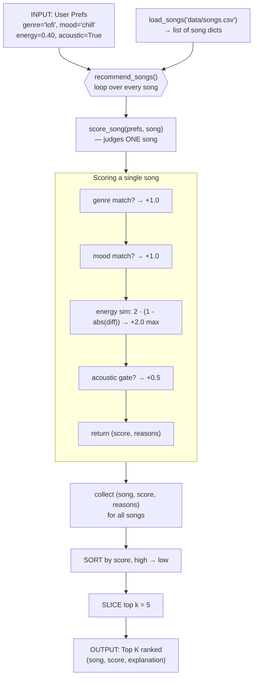

# 🎵 Music Recommender Simulation

## Project Summary

In this project you will build and explain a small music recommender system.

Your goal is to:

- Represent songs and a user "taste profile" as data
- Design a scoring rule that turns that data into recommendations
- Evaluate what your system gets right and wrong
- Reflect on how this mirrors real world AI recommenders

**My version — VibeMatch 1.0:** This recommender takes one listener's taste
(favorite genre, mood, target energy, and whether they like acoustic music) and
picks the top 5 songs for them from an 18-song catalog. Every song is scored with
a simple set of rules, and each recommendation comes with a short reason like
"genre match" or "energy close" so you can see *why* it was chosen. I tuned the
scoring so energy is the strongest signal, tested it against realistic and
"trick" listener profiles, and documented the biases I found (see the
[Model Card](model_card.md)).

---

## How The System Works

### How the system decides what to recommend

The recommender works in two steps. First, the **Scoring Rule** (`score_song`) grades one song at a time, adding up points for how well it matches the user's genre, mood, energy, and acoustic taste (a perfect song scores about 4.5). Then the **Ranking Rule** (`recommend_songs`) scores every song, sorts them highest-first, and keeps the top `k`. We need both because a single score means nothing on its own — `3.50` only matters once ranking lines it up against the others to show it's the 3rd-best pick. In short: scoring decides *how good* each song is, and ranking decides *which songs the user sees, and in what order*.

### Algorithm Recipe

Each song earns points from four independent checks. Exact-match signals score a flat amount; the numeric signal (energy) is graded so a near-miss still earns partial credit.

| Component | Points | Rule |
|---|---|---|
| **Genre match** | **+1.0** | `song.genre == favorite_genre` |
| **Mood match** | **+1.0** | `song.mood == favorite_mood` |
| **Energy similarity** | **+2.0 max** | `2.0 * (1 - abs(target_energy - song.energy))` |
| **Acoustic bonus** | **+0.5** | only if `likes_acoustic` **and** `acousticness >= 0.6` |

**Why these ratios:** Energy is the strongest single signal (up to +2.0), because *how energetic* a track is drives whether it fits the moment — studying vs. working out — more reliably than its label. Genre and mood are equal category anchors (+1.0 each): get the category and feel roughly right, then let the graded energy term do the fine sorting. Energy is graded rather than all-or-nothing, because a song `0.02` away is nearly as good a fit as an exact match. The acoustic bonus is a tiebreaker that only fires when the user actually cares (`likes_acoustic` is `True`), so it never penalizes listeners who don't.

> **Note:** These weights were chosen after a sensitivity experiment (halving genre from `2.0`→`1.0` and doubling energy `×1.0`→`×2.0`). See [Experiments You Tried](#experiments-you-tried) for the before/after comparison.

### Data flow

One song's journey from the CSV to the ranked list:



The key idea: `score_song` only ever sees **one** song — it knows nothing about ranking. Ranking is purely the sort-and-slice step that happens *after* the loop finishes scoring every song.

### Potential biases

Because the recipe now weights energy at 2.0 — double any category signal — I expect it to **over-prioritize energy**. A song with the "right" energy but the wrong genre *and* mood (best case 2.0 energy alone) can outrank a genre-only match (1.0). So the risk flips from the original design: instead of genre lock-in, the danger is that energy-similar tracks from unrelated genres crowd the list. Two more effects follow from the design:

- **Energy clustering:** because energy is correlated with genre in this catalog (lofi is low-energy, metal is high-energy), boosting energy mostly reinforces the same songs genre already favored — so at the *top* of the list the effect is muted, and it mainly reshuffles the lower ranks.
- **Ignored features:** `tempo_bpm`, `valence`, and `danceability` don't affect the score at all, so a song that's a great *feel* match on those dimensions gets no credit for it.

### Features used

**`Song`** — describes each song:

- `id`, `title`, `artist` — identifiers (not scored)
- `genre` — category, e.g. `lofi`, `pop`, `rock` *(scored)*
- `mood` — feel, e.g. `chill`, `intense`, `happy` *(scored)*
- `energy` — 0.0–1.0, calm vs. energetic *(scored)*
- `tempo_bpm` — speed in beats per minute (60–152)
- `valence` — 0.0–1.0, musical positivity
- `danceability` — 0.0–1.0, how danceable
- `acousticness` — 0.0–1.0, acoustic vs. electronic *(scored)*

**`UserProfile`** — describes the listener's taste:

- `favorite_genre` — compared to `song.genre`
- `favorite_mood` — compared to `song.mood`
- `target_energy` — 0.0–1.0, compared to `song.energy`
- `likes_acoustic` — `True`/`False`, compared to `song.acousticness`

The scoring rule uses `genre`, `mood`, `energy`, and `acousticness`. The other song features (`tempo_bpm`, `valence`, `danceability`) are in the data but unused by the base recipe — good candidates for an experiment.

---

## Getting Started

### Setup

1. Create a virtual environment (optional but recommended):

   ```bash
   python -m venv .venv
   source .venv/bin/activate      # Mac or Linux
   .venv\Scripts\activate         # Windows

2. Install dependencies

```bash
pip install -r requirements.txt
```

3. Run the app:

```bash
python -m src.main
```

### Running Tests

Run the starter tests with:

```bash
pytest
```

You can add more tests in `tests/test_recommender.py`.

---

## Sample Recommendation Output

Below is the real terminal output from `python -m src.main` for the built-in
"The Focused Studier" profile (`genre=lofi`, `mood=chill`, `target_energy=0.40`,
`likes_acoustic=True`), scored with the current weights (genre `+1.0`, energy `×2.0`):

```
Loaded songs: 18

============================================
  TOP RECOMMENDATIONS — The Focused Studier
  lofi / chill, energy 0.40, acoustic=True
============================================

1. Midnight Coding — LoRoom
   Score: 4.46
   Reasons:
     • genre match (lofi) +1.0
     • mood match (chill) +1.0
     • energy close (Δ0.02) +1.96
     • acoustic (0.71) +0.5

2. Library Rain — Paper Lanterns
   Score: 4.40
   Reasons:
     • genre match (lofi) +1.0
     • mood match (chill) +1.0
     • energy close (Δ0.05) +1.90
     • acoustic (0.86) +0.5

3. Focus Flow — LoRoom
   Score: 3.50
   Reasons:
     • genre match (lofi) +1.0
     • energy close (Δ0.00) +2.00
     • acoustic (0.78) +0.5

4. Spacewalk Thoughts — Orbit Bloom
   Score: 3.26
   Reasons:
     • mood match (chill) +1.0
     • energy close (Δ0.12) +1.76
     • acoustic (0.92) +0.5

5. Old Pine Road — The Wandering Kind
   Score: 2.46
   Reasons:
     • energy close (Δ0.02) +1.96
     • acoustic (0.88) +0.5
```

---

## Adversarial / Edge-Case Profiles

These profiles were designed to try to "trick" the scoring logic. Each block is
the **real terminal output** produced by running the profile through the
recommender. Three of the five expose genuine bugs; the notes above each block
say what the profile is testing and what went wrong.

### 1. Impossible energy (`target_energy = 5.0`) → negative scores

The energy term `2.0 * (1 - abs(target - energy))` is never clamped, so an
out-of-range target drives every score below zero — and the doubled energy
weight makes it *worse* than before (down to `-6.10`). A "top recommendation"
with a negative score is meaningless, and nothing validates the input range.

```
============================================
  TOP RECOMMENDATIONS — Impossible Energy (out of range)
  pop / happy, energy 5.00, acoustic=False
============================================

1. Sunrise City — Neon Echo
   Score: -4.36
   Reasons:
     • genre match (pop) +1.0
     • mood match (happy) +1.0
     • energy close (Δ4.18) +-6.36

2. Gym Hero — Max Pulse
   Score: -5.14
   Reasons:
     • genre match (pop) +1.0
     • energy close (Δ4.07) +-6.14

3. Rooftop Lights — Indigo Parade
   Score: -5.48
   Reasons:
     • mood match (happy) +1.0
     • energy close (Δ4.24) +-6.48

4. Iron Verdict — Ashen Crown
   Score: -6.04
   Reasons:
     • energy close (Δ4.02) +-6.04

5. Neon Pulse — Voltaic
   Score: -6.10
   Reasons:
     • energy close (Δ4.05) +-6.10
```

### 2. Conflicting: high energy + sad mood → silent contradiction

The user asks for energy `0.95` but a `sad` mood (which doesn't exist in the
catalog). The mood term silently never fires. Even with genre now downweighted
to `+1.0`, the lofi genre match still edges out the high-energy tracks the user
actually asked for — handing them *low-energy* lofi despite the `0.95` request
(note how narrow the margin is now: `2.44` vs. `2.00`). The scorer can't reason
about coherence.

```
============================================
  TOP RECOMMENDATIONS — Conflicting: High Energy + Sad Mood
  lofi / sad, energy 0.95, acoustic=True
============================================

1. Midnight Coding — LoRoom
   Score: 2.44
   Reasons:
     • genre match (lofi) +1.0
     • energy close (Δ0.53) +0.94
     • acoustic (0.71) +0.5

2. Focus Flow — LoRoom
   Score: 2.40
   Reasons:
     • genre match (lofi) +1.0
     • energy close (Δ0.55) +0.90
     • acoustic (0.78) +0.5

3. Library Rain — Paper Lanterns
   Score: 2.30
   Reasons:
     • genre match (lofi) +1.0
     • energy close (Δ0.60) +0.80
     • acoustic (0.86) +0.5

4. Neon Pulse — Voltaic
   Score: 2.00
   Reasons:
     • energy close (Δ0.00) +2.00

5. Gym Hero — Max Pulse
   Score: 1.96
   Reasons:
     • energy close (Δ0.02) +1.96
```

### 3. Wrong-case genre (`"Pop"` vs `"pop"`) → case-sensitivity bug

Matching is exact string equality, so `"Pop" != "pop"` and both category signals
(genre `+1.0`, mood `+1.0`) silently never fire. Ranking collapses to
energy-only — a real user who typed "Pop" gets quietly degraded results.

```
============================================
  TOP RECOMMENDATIONS — Wrong-Case Genre
  Pop / Happy, energy 0.82, acoustic=False
============================================

1. Sunrise City — Neon Echo
   Score: 2.00
   Reasons:
     • energy close (Δ0.00) +2.00

2. Concrete Dreams — Mic Fracture
   Score: 1.92
   Reasons:
     • energy close (Δ0.04) +1.92

3. Rooftop Lights — Indigo Parade
   Score: 1.88
   Reasons:
     • energy close (Δ0.06) +1.88

4. Night Drive Loop — Neon Echo
   Score: 1.86
   Reasons:
     • energy close (Δ0.07) +1.86

5. Storm Runner — Voltline
   Score: 1.82
   Reasons:
     • energy close (Δ0.09) +1.82
```

### 4. Nonexistent genre and mood → degenerate, confident-but-arbitrary ranking

With `polka` / `yodeling` never matching anything, the entire ranking reduces to
"closest energy to `0.50`." There is no error and no "no strong matches" signal —
the system confidently returns arbitrary picks.

```
============================================
  TOP RECOMMENDATIONS — Nonexistent Genre and Mood
  polka / yodeling, energy 0.50, acoustic=False
============================================

1. Velvet Hours — Solene
   Score: 2.00
   Reasons:
     • energy close (Δ0.00) +2.00

2. Island Time — Coral Bay
   Score: 1.90
   Reasons:
     • energy close (Δ0.05) +1.90

3. Midnight Coding — LoRoom
   Score: 1.84
   Reasons:
     • energy close (Δ0.08) +1.84

4. Focus Flow — LoRoom
   Score: 1.80
   Reasons:
     • energy close (Δ0.10) +1.80

5. Old Pine Road — The Wandering Kind
   Score: 1.76
   Reasons:
     • energy close (Δ0.12) +1.76
```

### 5. Dislikes acoustic (`likes_acoustic = False`) → the flag is inert

The acoustic term only ever *rewards*, so setting the flag to `False` has zero
effect: the ranking is identical to the "likes acoustic" case minus the `+0.5`
lines. A user who explicitly dislikes acoustic music is never steered away from
it — the preference is unfalsifiable.

```
============================================
  TOP RECOMMENDATIONS — Dislikes Acoustic (flag is inert)
  lofi / chill, energy 0.40, acoustic=False
============================================

1. Midnight Coding — LoRoom
   Score: 3.96
   Reasons:
     • genre match (lofi) +1.0
     • mood match (chill) +1.0
     • energy close (Δ0.02) +1.96

2. Library Rain — Paper Lanterns
   Score: 3.90
   Reasons:
     • genre match (lofi) +1.0
     • mood match (chill) +1.0
     • energy close (Δ0.05) +1.90

3. Focus Flow — LoRoom
   Score: 3.00
   Reasons:
     • genre match (lofi) +1.0
     • energy close (Δ0.00) +2.00

4. Spacewalk Thoughts — Orbit Bloom
   Score: 2.76
   Reasons:
     • mood match (chill) +1.0
     • energy close (Δ0.12) +1.76

5. Old Pine Road — The Wandering Kind
   Score: 1.96
   Reasons:
     • energy close (Δ0.02) +1.96
```

**Common thread:** the scorer treats every input as valid — it never validates
ranges, never checks inputs against the catalog's actual vocabulary, is
case-sensitive, and treats each signal as independent and additive. So
contradictory or malformed profiles produce confident-but-wrong output instead
of a flag.

---

## Experiments You Tried

### Weight-shift sensitivity test (genre `2.0`→`1.0`, energy `×1.0`→`×2.0`)

**Hypothesis:** the original genre weight (`+2.0`, double every other signal) was
over-prioritizing genre and crowding out variety. I halved genre and doubled
energy to see how sensitive the rankings were. The scoring ceiling stayed the
same (`1.0 + 1.0 + 2.0 + 0.5 = 4.5`) — the points were just redistributed.

**Result — the #1 pick did not move for any built-in profile:**

| Profile | #1 before (score) | #1 after (score) |
|---|---|---|
| Chill Lofi Studier | Midnight Coding (4.48) | Midnight Coding (4.46) |
| High-Energy Pop | Sunrise City (3.97) | Sunrise City (3.94) |
| Deep Intense Rock | Storm Runner (3.99) | Storm Runner (3.98) |

The movement was all in the **lower ranks and the gaps**. For the lofi profile,
the gap between #3 (lofi `Focus Flow`) and #4 (ambient `Spacewalk Thoughts`)
collapsed from **1.12 → 0.24**, and cross-genre tracks surged (`Spacewalk
Thoughts` 2.38 → 3.26; `Old Pine Road` 1.48 → 2.46).

**What I learned:** the rankings were *less* sensitive to this large weight swing
than expected. The reason is a property of the **dataset** — energy is correlated
with genre (lofi is low-energy, metal is high-energy), so boosting energy mostly
rewards the same songs genre already favored. Sensitivity depends as much on the
data's structure as on the weights. I kept the new weights because they preserve
the correct top picks while giving cross-genre variety a foothold in the lower
ranks. (The out-of-range energy bug in the adversarial section is *unaffected* by
this change — it's a separate input-validation issue.)

---

## Limitations and Risks

- **Tiny catalog.** There are only 18 songs, and most genres have just one song.
  Fans of niche genres have almost nothing to pick from.
- **Energy gap in the data.** Songs are either fairly calm or very energetic, with
  almost nothing in the middle. A listener who wants "medium energy" can never get
  a great match.
- **Acoustic bonus is really a "calm" bonus.** Every acoustic song in the catalog
  is also low-energy, so liking acoustic music only ever helps quiet songs. This
  quietly tilts the whole system toward calm music.
- **No input validation.** An out-of-range energy value (like `5.0`) produces
  negative, meaningless scores instead of an error.
- **Exact text matching.** Genre and mood must match exactly, so `"Pop"` misses
  `"pop"`, and similar moods like `"chill"` and `"relaxed"` are treated as
  unrelated.
- **Ignores audio and lyrics.** The model only reads numbers and labels from a
  CSV. It does not understand how a song actually sounds, so it can't judge feel
  beyond the four features it scores.

I go deeper on these in the [Model Card](model_card.md).

---

## Reflection

Read and complete the [**Model Card**](model_card.md).

### Reflection on my engineering process

My biggest learning moment was the weight experiment. I halved the genre weight
and doubled the energy weight, expecting the recommendations to change a lot. They
barely moved — the #1 pick stayed the same for every profile. Digging into *why*
taught me the real lesson: it wasn't the weights, it was the data. Calm genres
happen to have calm songs, so genre and energy often point at the same tracks.
That was the moment I stopped thinking of the algorithm and the dataset as
separate things.

Using an AI assistant sped me up a lot. It helped me write test profiles, run the
scorer over the whole catalog, and turn raw output into clear tables. But I
learned I had to double-check its claims against the actual data. For example, it
suggested that one song might dominate every list — so I ran a quick script, and
that turned out to be false for my profiles. Another time it pointed out that all
my "acoustic" songs are also low-energy; that one *was* true, but I only trusted
it after I printed the numbers myself. The rule I settled on: let the AI propose
ideas fast, but verify anything factual by running the code.

What surprised me most is how a pile of simple `+1` and `+2` rules can still
*feel* like real recommendations. There is no machine learning here, just adding
up points — but the top picks genuinely look sensible for a studier or a gym
listener. It made me realize that a lot of what feels "smart" in an app can come
from very plain rules plus a good explanation for each pick.

If I extended this project, I would first add more songs, especially medium-energy
ones, since my data has a big gap in the middle. Next I would group similar moods
(like "chill," "relaxed," and "laid-back") so the mood score helps more often. And
I would add input checks so an out-of-range energy value can't produce a negative,
meaningless score like the bug I found while testing.


